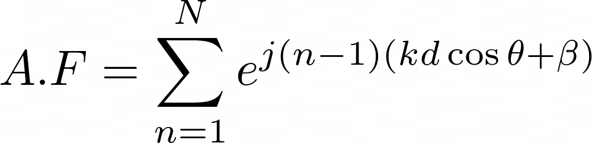
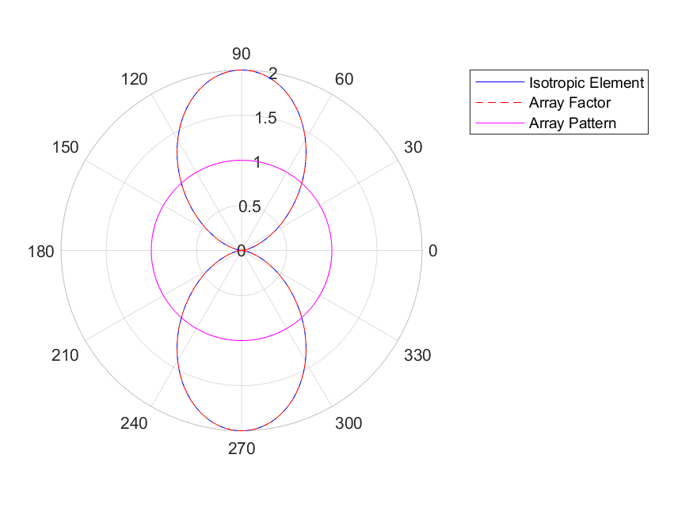
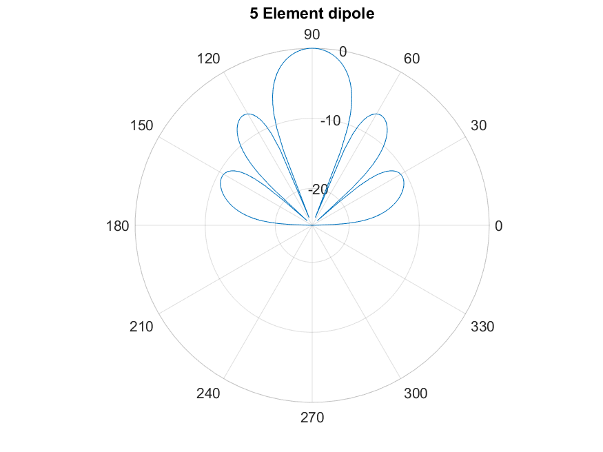

## Array

Hello world

The basic two element array with a omni-directional element is synthesised using eq(10)

A simple two element array of omnidirectional antennas can me simulated using [m-file](https://github.com/adrian-mckernan/Array/blob/main/Dual_element_isotropic.m) to give 

A 5 element array of omnidirectional antennas can me simulated using [m-file](https://github.com/adrian-mckernan/Array/blob/main/Five_Element_dipole.m) to give 

Repository
[Matlab Files](https://github.com/adrian-mckernan/array)

[back](./)