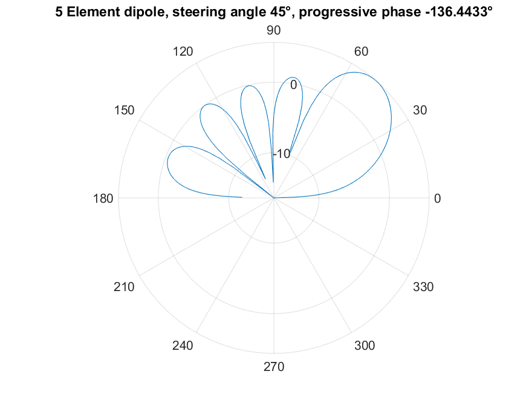
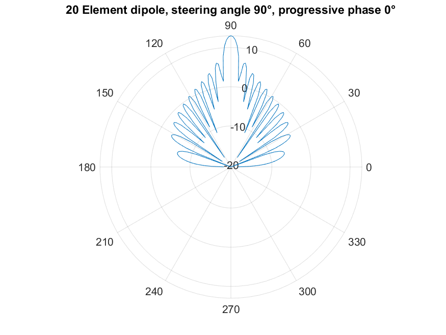

## Array

The basic two element array with a omni-directional element is synthesised using eq(10)

A simple two element array of omnidirectional antennas can me simulated using this [m-file](https://github.com/adrian-mckernan/Array/blob/main/Dual_element_isotropic.m) to give 

A 5 element array of omnidirectional antennas can me simulated using this [m-file](https://github.com/adrian-mckernan/Array/blob/main/Five_Element_dipole.m) to give 

A function is provided which can be used to calculate the progressive phase for an n-element dipole array [m-file](https://github.com/adrian-mckernan/Array/blob/main/plot_n_element_dipole_array.m) 

 

Repository
[Matlab Files](https://github.com/adrian-mckernan/array)

[back](../)