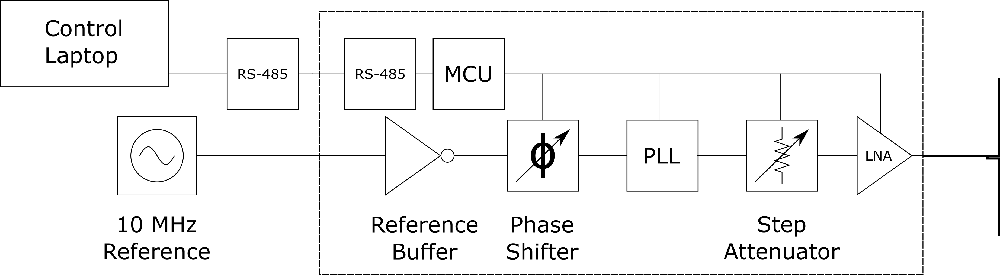

## Hardware

The hardware for this project is made up of several different PCBs.

The main PLL board is made of 5 PLL all driven form the same reference 

The boards are controlled from a custom windows application and communications between the PC and PLLS is done over RS-485. For this there are two PCBs, one connects a  RS-485 transceiver to a sparkfun USB to serial breakout board and another connects a RJ-45 to the PLL board

The PLL boards have been designed to be stacked on top of each other. To aid in providing a single reference interface there is a reference distribution board

Finally to provide a stable power source to the stacked PLLs a power distribution board has been made. 

- [PLL Board](PLL_board.html) 
- [RS-485 Boards](RS485_board.html)
- [Reference Board](Reference_board.html)
- [Power Board](Power_board.html)

[back](../)