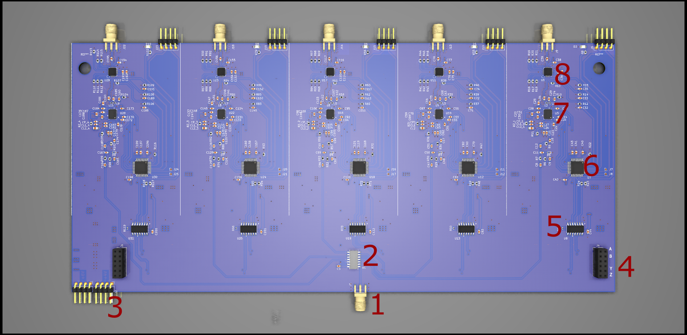

## Hardware

Each PCB contains 5 LTC6946 PLLS. Each PLL shares the same 10MHz source.

In order to be able to adjust the output phase of each PLL the square wave 10MHz reference is put through a low pass filter with a Varactor. By changing the voltage on the varactor the rise time of the square wave is adjusted moving the point at which the PLL locks on to the reference. This voltage is output form a DAC on the STM32F051 microcontroller

| Reference | description | link |
| -------| ------|
|1 | 10 MHz reference  input| |
| 2 | Hex invertor reference buffer | [74HC04](https://www.ti.com/lit/gpn/sn74hc04) |
| 3 | Power input | |
| 5 | RS-485 transceiver | [MAX3089](https://www.maximintegrated.com/en/products/interface/transceivers/MAX3089.html)| 
| 6 | Microcontroller| [STM32F051K4Tx](https://www.st.com/en/microcontrollers-microprocessors/stm32f050k4.html) | 
| 7 |  PLL | [LTC6946IUFD-4-PBF](https://www.analog.com/en/products/ltc6946.html)|
| 8 | Attenuator |[DAT-15R5A-SP+](https://www.minicircuits.com/WebStore/dashboard.html?model=DAT-15R5A-SP%2B)|

A pdf of the schematic for the main board can be found [Hardware](https://github.com/adrian-mckernan/Hardware/blob/main/PLL_v2/sch/PLL_v2.pdf) 

[back](./)