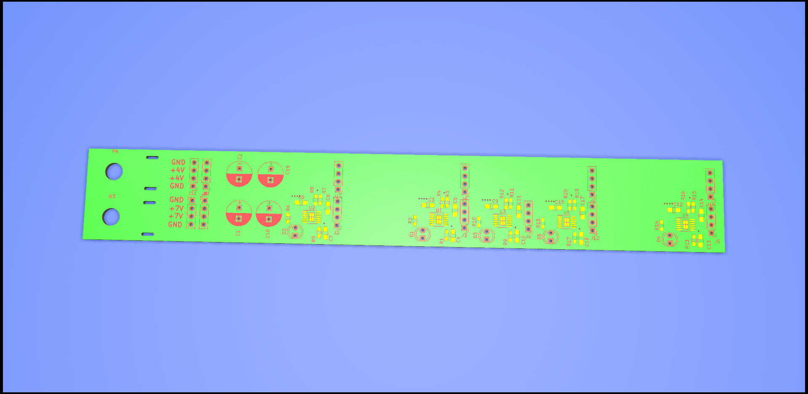

## Hardware

Each PLL board accepts two power inputs a 4V and 6V. the 4V bus has local regulation to 3.3V for each microcontroller and PLL section. The 6V bus is used to directly power the Hex inverter reference buffer before being locally regulated to 5V for the PLL.

The PCB was designed in KiCAD and is available [here](https://github.com/adrian-mckernan/Hardware/blob/main/Power%20Board%20V2/).

A pdf of the schematic for the Power board can be found [here](https://github.com/adrian-mckernan/Hardware/blob/main/Power%20Board%20V2/sch/Power%20Board.pdf) 

- [Hardware page](Hardware.html)
- [PLL Board](PLL_board.html) 
- [RS-485 Boards](RS485_board.html)
- [Reference Board](Reference_board.html)

[back](../)