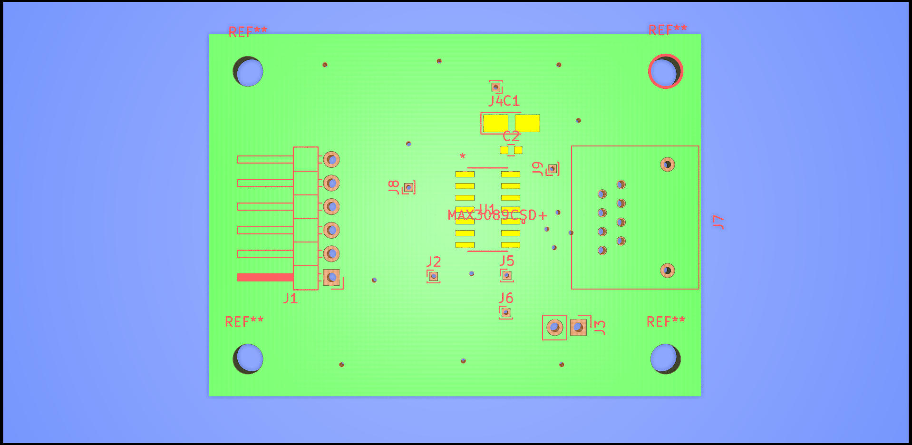
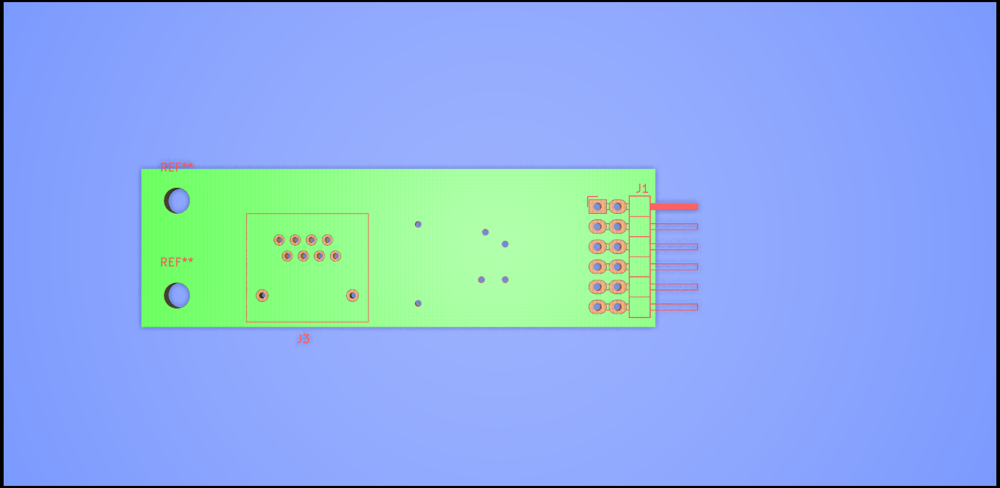

## Hardware

The software application communicates with the microcontrollers via a serial interface over RS-485. For this two PCBs have been made. 

The first PCB was designed to connect to a spark fun [FTDI breakout board](https://www.sparkfun.com/products/9873)

This board contains an MAX3089 RS-485 transceiver and connectors to a RJ-45 socket allowing a standard ethernet LAN cable to be used to connect between the PLL array and PC

The PCB was designed in KiCAD and is available [here](https://github.com/adrian-mckernan/Hardware/blob/main/RS-485_FTDI/).

A pdf of the schematic for the RS-485 to FTDI board can be found [here](https://github.com/adrian-mckernan/Hardware/blob/main/RS-485_FTDI/sch/RS-485_FTDI.pdf) 

For the PLL side the rRS-485 signals run in a bus along the reference input side of the boards. With stubs going to a transceiver for each microcontroller.  At each side of the board there is a 2x6 0.1" header which is connected to two pairs of differential signals and ground.  The second board in a an interface between RJ-45 and this header 

The PCB was designed in KiCAD and is available [here](https://github.com/adrian-mckernan/Hardware/tree/main/RJ_45_RS-485_LTC946_PLL).

A pdf of the schematic for the RS-485 to FTDI board can be found [here](https://github.com/adrian-mckernan/Hardware/blob/main/RJ_45_RS-485_LTC946_PLL/sch/RJ_45_RS-485_breakout.pdf) 

- [Hardware page](Hardware.html)
- [PLL Board](PLL_board.html) 
- [Reference Board](Reference_board.html)
- [Power Board](Power_board.html)

[back](../)
