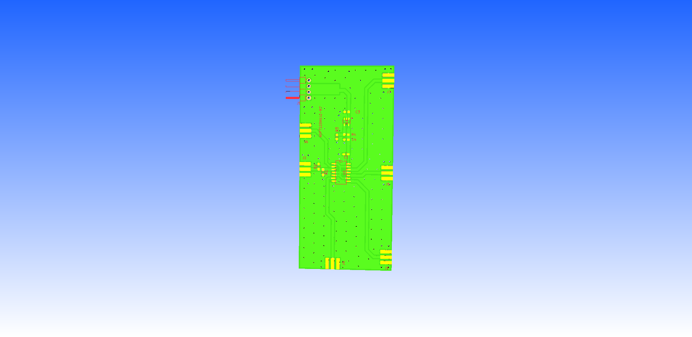

## Hardware

When multiple PLL boards are stacked the 10MHz reference needs to be buffered before each board. The same Hex inverter (74HC04) chip as used on the main PLLs boards is used. 

The PCB was designed in KiCAD and is available [here](https://github.com/adrian-mckernan/Hardware/blob/main/clock_dist_v4/).

A pdf of the schematic for the 10MHz reference distribution bboard can be found [here](https://github.com/adrian-mckernan/Hardware/blob/main/clock_dist_v4/sch/clock_dist.pdf) 

- [Hardware page](Hardware.html)
- [PLL Board](PLL_board.html) 
- [RS-485 Boards](RS485_board.html)
- [Power Board](Power_board.html)

[back](../)