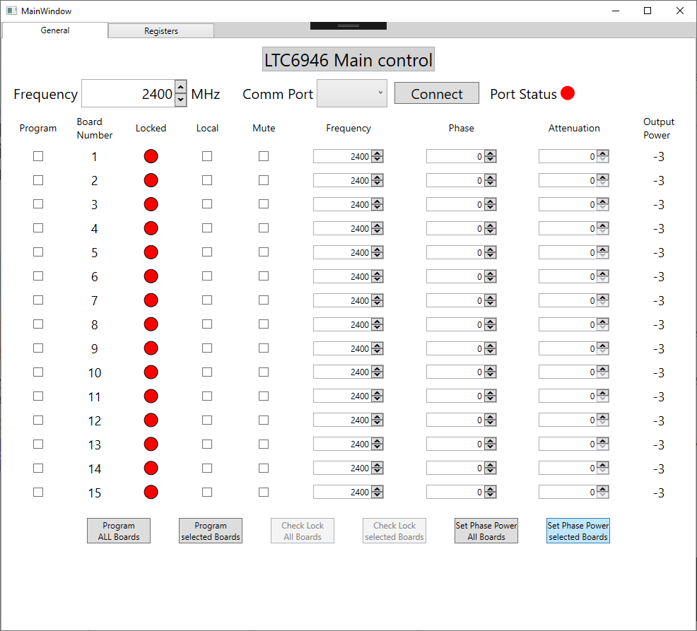
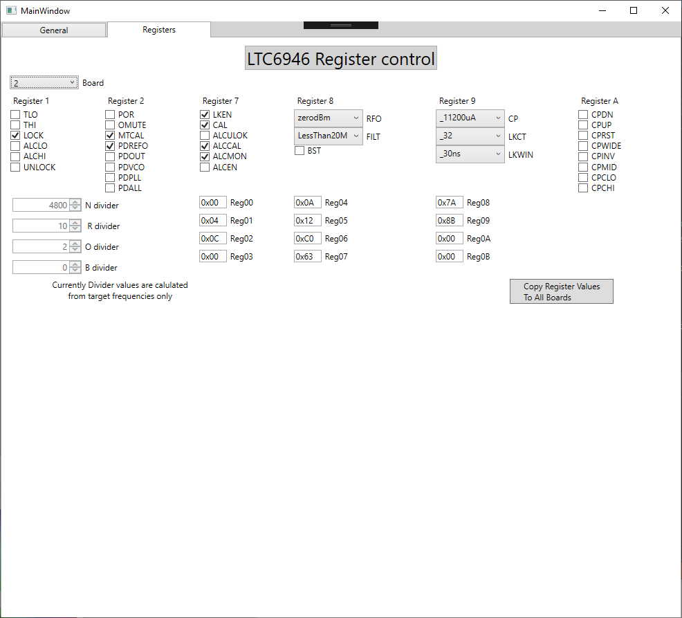

## software

The aim of the desktop software is to be able to make changes to either a single board, a group of boards or all boards at the same time.

The general tab allows the frequency off all boards to be controlled.

If you want to change the frequency of an individual board then use the local tick box.

You can add PLL to your selected boards for changing phase or adjusting phase  and power by using the tick boxes under program.

The phase and power are separated from programming as they don't communicate with the PLL but change the DAC voltage on the phase shifter and the attenuator level.

Pressing mute will automatically end a packet to the PLL to mute the output.

A finer control over induvial register setting with in the PLL is available in the register tab.

After setting a single register these setting can be copied to other PLLs. Once you have configured your registers in the software these values have to be sent to the PLL by programming them from the general tab.

[Desktop software Repository](https://github.com/adrian-mckernan/Software/tree/main/LTC6946)

- [STM32F051 firmware](embedded_software.html)

[back](../)
